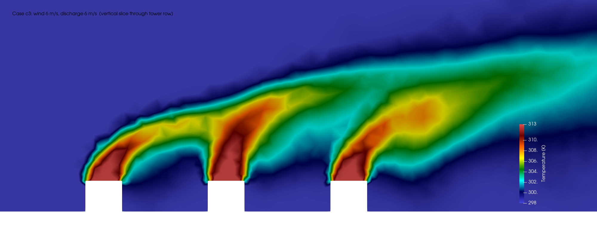

# Cooling-Tower Array: CFD Sweep and a Physics-Informed Surrogate

An end-to-end demonstration that pairs steady-state CFD with a physics-constrained
neural surrogate on a thermal problem: an array of six cooling towers discharging warm
plumes into an atmospheric crosswind, and the hot-air recirculation those plumes drive
onto the downwind towers' intakes.

The point of the project is the pipeline, not the specific numbers: run a small
parametric CFD study in ANSYS Fluent, then train a network that reproduces the full 3D
temperature and velocity field for operating points it never saw, in milliseconds
instead of a solver run, while respecting mass conservation.



## What is in here

| Path | What it is |
|---|---|
| `cfd/mesh_gen.py` | Builds the 3D geometry (atmospheric box minus six tower blocks) in gmsh and writes a native Fluent `.msh` with named boundary zones. |
| `cfd/extract_field.py` | Reads a solved Fluent CFF `.cas.h5`/`.dat.h5` pair and extracts cell-centred fields (x, y, z, u, v, w, T, p) to a compact `.npz`. |
| `pinn/pinn_surrogate.py` | The physics-informed parametric surrogate: Fourier-feature MLP mapping (x, y, z, wind, discharge) to the velocity and temperature field, trained with a divergence-free mass-conservation loss (autograd). |
| `pinn/analyze.py` | Recirculation metric per tower, parametric trend plots, surrogate-vs-CFD parity, training history. |
| `figures/` | Result figures (ParaView contours and matplotlib charts). |
| `report/` | Full technical report. |

Large binaries (the Fluent mesh, case/data files, and the per-case field `.npz`) are not
tracked here; regenerate them with the scripts below.

## The case

A rectangular atmospheric domain of 280 x 140 x 80 m holds six cooling-tower cells
(12 x 12 m footprint, 10 m tall) arranged in three columns along the wind and two rows
across it. Wind enters as a uniform velocity inlet; each tower discharges warm air
(313 K) upward from its top face into a 298 K ambient. The mesh is an unstructured
tetrahedral grid of 105,676 cells refined around the towers and through the plume
corridor (minimum orthogonal quality 0.136).

Physics: steady RANS, realizable k-epsilon with standard wall functions, energy on,
air as incompressible ideal gas under gravity so buoyancy is captured through the
temperature-dependent density. Pressure-based SIMPLE, PRESTO pressure, staged
first-then-second-order momentum, 600 iterations per case. Mass balance closes to
better than 0.03 percent and the energy budget to better than 0.1 percent for every case.

## The sweep

Seven cases spanning wind speed and plume discharge velocity:

| Case | Wind U (m/s) | Discharge V (m/s) | V/U | Array-mean recirc. (%) | Worst-tower recirc. (%) |
|---|---|---|---|---|---|
| c1 | 3.0 | 6.0 | 2.0 | 0.61 | 2.41 |
| c2 | 1.5 | 6.0 | 4.0 | 0.24 | 0.83 |
| c3 | 6.0 | 6.0 | 1.0 | 1.22 | 1.62 |
| c4 | 3.0 | 3.0 | 1.0 | 0.59 | 1.38 |
| c5 | 3.0 | 9.0 | 3.0 | 0.14 | 0.55 |
| c6 | 1.5 | 3.0 | 2.0 | 0.27 | 1.33 |
| c7 | 6.0 | 9.0 | 1.5 | 0.89 | 1.88 |

Recirculation coefficient is `(T_intake - T_ambient) / (T_discharge - T_ambient)`,
sampled in the intake band just outside each tower's walls. The trend is the story:
strong wind and weak plumes (low V/U) bend the plumes down onto downwind intakes and
raise recirculation; strong buoyant plumes (high V/U) rise clear and keep intakes cold.

## The surrogate

A small network maps `(x, y, z, U_wind, V_discharge)` to `(u, v, w, theta)`, where
`theta` is normalised temperature. Spatial inputs are Fourier-encoded so the network can
represent the sharp plume gradients; the loss combines a data term against the CFD cells
with a physics term that penalises the divergence of the predicted velocity field
(central finite differences), pushing the surrogate toward mass conservation rather than
pointwise curve fitting.

It is trained on six cases and the centre operating point (c1: wind 3, discharge 6) is
held out entirely. On that unseen case it reconstructs the temperature field to
**1.62 K RMSE (R^2 = 0.76)** and evaluates in milliseconds. Velocity is harder
(R^2 ~ 0.35), as expected for a turbulent field from a compact model.

This is a deliberate demonstrator: coarse RANS, a small network, and a mass-conservation
constraint that is only part of the governing physics. It shows the shape of the workflow,
not a production model.

## Reproducing

```bash
# 1. Mesh (needs gmsh)
python cfd/mesh_gen.py cfd/mesh/tower_array.msh 2.0 12.0

# 2. Solve the 7 cases in ANSYS Fluent (2021 R1) from the TUI journals, then
#    extract each solved case to a field .npz
python cfd/extract_field.py cfd/cases/case_c1 3 6 data/c1_field.npz
# ... repeat for c2..c7

# 3. Analyse + figures
python pinn/analyze.py data figures

# 4. Train the surrogate (resumable in chunks)
python pinn/pinn_surrogate.py chunk 130
# ... repeat until converged, then:
python pinn/pinn_surrogate.py finalize
```

Dependencies: `gmsh`, `numpy`, `h5py`, `matplotlib`, `autograd`, plus ANSYS Fluent for the
CFD step. ParaView was used for the contour figures.

## License

MIT. See `LICENSE`.
